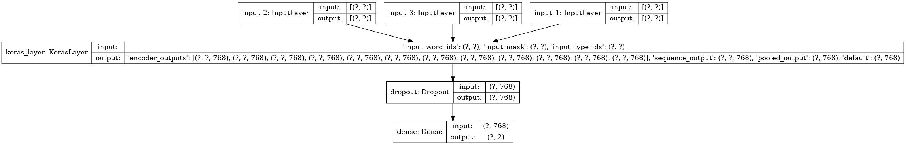

# Semantic Paraphrase Detection
*By Pranav Goyal and Saransh Rajput*

## Task

Given two sentences, the task is to classify if the the sentences are paraphrase of each other. This is a binary classification. The task is a generalization of the *semantic textual similarity* which would be about finding the level of similarity among two sentences.

## Datasets

+ **Quora Question Pairs (QQP)** - 404300 sentence pairs
+ **Microsoft Paraphrase COrpus (MSRP)** - 5800 sentence pairs

## Models Implemented

### 1. Bidirectional Multi-Perspective Matching (BiMPM)

Details:
+ Uses pretrained Glove embeddings (6B)
+ Bidirectional LSTM to encode the sentences
+ Three Distinct multi-perspective matching mechanisms to measure the relations across sentences
+ Final LSTM to generate fixed-size vector and a feed-forward network to predict the output 

Related Files:
+ `1_BiMPM-MSRP.ipynb`
+ `1_BiMPM-QQP.ipynb`

### 2. Multiway Attention
Details:

Related Files:
+ `2_Multiway_Attention-MSRP.ipynb`
+ `2_Multiway_Attention-QQP.ipynb`

### 3. Finetune BERT-Base 

Details:
+ Fine-tuned Bert Base Model (12 layers of stacked transformers with 768 hidden dimention) with a binary classification dense layer on top.
+ Original Pretrained Model: [bert_en_uncased_L-12_H-768_A-12_3](https://tfhub.dev/tensorflow/bert_en_uncased_L-12_H-768_A-12/2)

Related Files:
+ `3_Finetune_BERT-MSRP.ipynb`
+ `3_Finetune_BERT-QQP.ipynb`

## Results
No  | Models            | Validation Accuracy on QQP | Validation Accuracy on MSRP 
--- | -----             | :-------------------:| :-----:|
| 1 |  BiMPM  | 85.28 %  | 72.52 %
| 2 |  Multiway Attention  |  | 
| 3 |  Bert Finetuning  | 90.10 % | 84.12 %

## Report
`Project_Report.pdf`

## References 
+ “Fine-Tuning a BERT Model  :   TensorFlow Core.” TensorFlow, www.tensorflow.org/official_models/fine_tuning_bert. 
+ Devlin, Jacob, et al. "Bert: Pre-training of deep bidirectional transformers for language understanding." arXiv preprint arXiv:1810.04805 (2018).
+ Wang, Zhiguo, Wael Hamza, and Radu Florian. "Bilateral multi-perspective matching for natural language sentences." arXiv preprint arXiv:1702.03814 (2017).